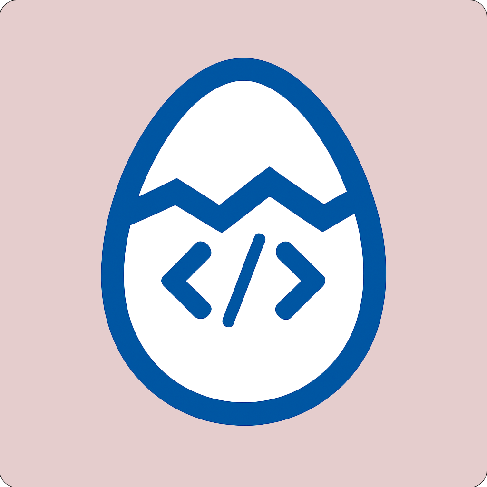

<div align="center">



# Hatch

**A fast, Rust-powered dependency and build manager for Flutter.**

[](https://github.com/mario-chamuty/hatch/releases)
[](https://github.com/mario-chamuty/hatch/actions/workflows/ci.yml)
[](https://github.com/mario-chamuty/hatch/releases)
[](#-license)

[Why Hatch is fast](#-why-hatch-is-fast) · [File purging](#-file-purging-debloat) · [Caching](#-caching) · [Private Nests](#-private-nests-planned) · [Commands](#-commands)

</div>

---

> [!IMPORTANT]
> **Hatch is an independent, third-party project.** It is **not** affiliated with,
> endorsed by, or associated with Google, the Flutter project, or the Dart project
> in any way. "Flutter" and "Dart" are trademarks of Google LLC; they are used here
> only to describe interoperability. Hatch talks to the public pub.dev API and the
> standard Flutter/Dart toolchain as an ordinary client.

## Overview

Hatch is a single native binary that resolves, downloads, and caches your Flutter
dependencies, manages Flutter SDKs through FVM, and (as its headline capability)
can build, sign, and ship iOS apps to TestFlight **without a Mac**.

It reads a small `hatch.json` (or `hatch.yaml`) manifest, resolves the full
dependency graph with a parallel solver, slims every package down on the way into
a machine-global cache, and wires your project up for the standard Flutter
toolchain.

### What works today

| Area | Status |
|------|--------|
| pub.dev resolution (parallel solver, lockfile) | ✅ Working |
| Local **path** dependencies (monorepos) | ✅ Working |
| Package **file purging / debloat** on extract | ✅ Working |
| Machine-global **cache** (stats / clear / remove / prune) | ✅ Working |
| Mandatory **checksum** verification + audit log | ✅ Working |
| **FVM** integration (`list` / `use` / `install` / `sync`) | ✅ Working |
| `migrate` (`pubspec.yaml` → `hatch.json`) | ✅ Working |
| Project **scripts** (shell or argv array) with trust prompts | ✅ Working |
| **Mac-free iOS** build / sign / upload | ✅ Working (Linux native; Windows native) |
| **Git** dependencies | 🚧 Parsed & validated, resolution planned |
| **Private Nests** / `hatch.dev` registry | 🚧 Planned (see below) |
| **Profiles** (`--profile` at install) | 🟡 Partial (selection works; live switching planned) |
| Build-number sync / artifact dashboard | 🚧 Planned |

## 📦 Installation

### Prebuilt binaries

Download the archive for your platform from the
[latest release](https://github.com/mario-chamuty/hatch/releases/latest), unpack
it, and put `hatch` (or `hatch.exe`) on your `PATH`.

### Install scripts

```bash
# Linux / macOS
curl -fsSL https://raw.githubusercontent.com/mario-chamuty/hatch/main/install.sh | bash
```

```powershell
# Windows (PowerShell)
irm https://raw.githubusercontent.com/mario-chamuty/hatch/main/install.ps1 | iex
```

### From source

```bash
git clone https://github.com/mario-chamuty/hatch.git
cd hatch
cargo build --release --locked
# binary at target/release/hatch
```

## 🚀 Quick start

```bash
# New project
hatch init my_app && cd my_app

# Or adopt an existing Flutter project (converts pubspec.yaml -> hatch.json)
hatch migrate

# Resolve + download + cache dependencies
hatch install

# Add / remove
hatch add http ^1.0.0
hatch add --dev mockito ^5.0.0
hatch remove http

# Explain a dependency
hatch why http
```

## 📄 Manifest (`hatch.json`)

```json
{
  "name": "my_flutter_app",
  "version": "1.0.0",

  "sdk": {
    "flutter": "3.35.2",
    "dart": ">=3.5.0 <4.0.0"
  },

  "require": {
    "http": "^1.0.0",
    "provider": "^6.0.0",
    "local_package": { "version": "any", "path": "../packages/local_package" }
  },

  "require-dev": {
    "test": "^1.24.0"
  },

  "scripts": {
    "post-install": "dart run build_runner build",
    "test": "flutter test"
  }
}
```

The full schema (profiles, scripts, nests, SDK constraints, the per-package
`.hatch.json` debloat overrides) is documented in
[`docs/manifest.md`](docs/manifest.md) and
[`docs/package_hatch_json.md`](docs/package_hatch_json.md).

## ⚡ Why Hatch is fast

Hatch is not "fast" because it is written in Rust and leaves it at that. The speed
comes from doing less work and doing the unavoidable work in parallel:

1. **Manifest-hash resolution cache.** Every resolve hashes the manifest first. If
   nothing changed since last time, the previously solved version map is returned
   without invoking the solver or touching the network at all.
2. **Interval propagation before the SAT solver.** A top-down propagator narrows
   each package's allowed version range first. Packages that propagation pins
   completely never reach the expensive solver. In the common, conflict-free case
   the full SAT solve is skipped entirely.
3. **Parallel metadata fetching.** Version metadata for every package is fetched
   concurrently (bounded by a semaphore), and anything already in the metadata
   cache is served locally with no round-trip.
4. **Independent-subgraph parallelism.** The residual dependency graph is split
   into connected components (via `petgraph`); disjoint components provably cannot
   conflict, so each is solved on its own `rayon` thread in parallel and the
   results are merged.
5. **PubGrub for the rest.** Whatever genuinely needs constraint solving goes to a
   PubGrub solver, which also gives precise, human-readable conflict explanations.

On top of resolution, **debloat** (below) means far fewer bytes are written to
disk and far fewer files are walked on every subsequent install, and the
**machine-global cache** means a package is downloaded and unpacked once per
machine, not once per project.

> Reproducible micro-benchmarks live in [`benches/`](benches/) (`cargo bench --bench resolver`).
> They are synthetic fixtures on a warm cache, not marketing numbers; run them on
> your own hardware rather than trusting a headline multiple.

## 🧹 File purging (debloat)

Published Dart/Flutter packages ship a lot of things you never compile: example
apps, test suites, generated docs, screenshots, CI config, editor folders. Hatch
**strips that on the way into the cache**, so the extracted tree is the code your
build actually needs and nothing else.

**Always removed** (directory and everything under it): `example/`, `examples/`,
`test/`, `tests/`, `doc/`, `docs/`, `.git/`, `.github/`, `.idea/`, `.vscode/`,
`screenshots/`, plus `*.psd`, `.DS_Store`, `Thumbs.db`, and stray root dotfiles.

**Always kept** (this list always wins over stripping): `lib/`, `bin/`, `tool/`,
the package manifests (`pubspec.yaml`/`pubspec.lock`/`hatch.*`), and
`README*` / `LICENSE*` / `CHANGELOG*`.

**Asset-aware.** Hatch reads the package's `pubspec.yaml` and preserves anything it
actually declares: `flutter.assets`, font files, and the platform folders listed
under `flutter.plugin.platforms` (only the real platforms: `android`, `ios`,
`linux`, `macos`, `windows`, `web`).

**Per-package overrides.** A package can ship a root `.hatch.json` with `keep` /
`strip` glob lists to fine-tune what survives:

```json
{ "hatch_package_version": 1, "keep": ["assets/**"], "strip": ["lib/legacy/**"] }
```

**Kill switch.** Set `HATCH_DEBLOAT=0` to extract packages verbatim with no
filtering at all.

See [`docs/package_hatch_json.md`](docs/package_hatch_json.md) for the full rules.

## 🗄️ Caching

Hatch keeps one cache per machine, shared across every project:

```
~/.hatch/cache/
├── packages/<registry>/<name>/<version>/   # debloated, ready-to-use trees
├── downloads/<name>-<version>.tar.gz        # transient; deleted after extraction
└── metadata/<registry>/<name>.json          # version lists (7-day TTL, GC'd)
```

- **Global & shared.** Download and unpack `http 1.2.0` once; every project on the
  machine reuses it.
- **Relocatable.** Point `HATCH_CACHE_DIR` at an absolute path (handy for CI cache
  restore, or a shared/air-gapped volume).
- **Integrity-checked.** Every download must carry a checksum or the install
  aborts; bypass per-invocation with `--allow-unchecksummed` (each bypass is
  written to `~/.hatch/audit.log`).
- **Self-maintaining.** Metadata expires after 7 days and is garbage-collected at
  most once a day; `hatch cache prune --aggressive` re-applies debloat and trims
  to lockfile-referenced versions.

```bash
hatch cache stats              # location, size, package count
hatch cache list --detailed
hatch cache remove http        # or: hatch cache remove http 1.1.0
hatch cache prune --aggressive
hatch cache clear --force
```

Full details in [`docs/cache.md`](docs/cache.md).

## 🪺 Private Nests (planned)

> **Status: not yet implemented.** The manifest already accepts and validates
> `nest` dependency sources, but resolution from a private registry is not wired up
> yet. This section describes the intended design so the manifest format makes
> sense; do not rely on it working today.

A **Hatch Nest** is a self-hostable private registry for **storing and caching**
your team's dependencies. The goal is one place that:

- **Hosts private packages** that must never go to public pub.dev (internal SDKs,
  client work, paid components).
- **Hosts forks** of public packages under your own scope, so a patched `http` is
  consumed like any other dependency instead of via a brittle `git` ref.
- **Mirrors / caches pub.dev**, so CI and air-gapped builds pull from a fast,
  controlled endpoint and stay reproducible even if an upstream package is
  unpublished.

Planned manifest shape:

```json
{
  "nests": [
    { "name": "company", "url": "https://packages.company.com", "auth": true }
  ],
  "require": {
    "internal_sdk": { "version": "^2.0.0", "nest": "company" }
  }
}
```

Credentials would live in a git-ignored `hatch_auth.json` (or `HATCH_NEST_*` env
vars), never in the manifest. See [`docs/dependencies.md`](docs/dependencies.md)
for the current validation rules.

## 🍎 Mac-free iOS builds

Hatch's headline capability is building, signing, and uploading iOS apps to the
App Store / TestFlight **with no macOS anywhere** – no Mac, no cloud Mac, no Xcode,
no `actool`. It compiles the Dart AOT snapshot, links a valid iOS Mach-O with
LLVM/`lld`, assembles the `App.framework` and an Apple-compatible `Assets.car`,
signs with `rcodesign`, and uploads through the App Store Connect API:

```bash
hatch ios doctor                       # check the toolchain
hatch ios build --bundle-id com.you.app --name "My App" --sign --distribution
hatch ios publish --ipa build/app.ipa  # upload to App Store Connect
```

This is a deep, evolving subsystem (Linux runs the fully native Rust pipeline by
default; a Windows-native path is in progress). It is intentionally kept separate
from the dependency-management core documented above.

## 🛠️ Commands

| Command | Description |
|---------|-------------|
| `hatch init [name]` | Scaffold a new project |
| `hatch install` | Resolve + download + cache dependencies |
| `hatch add <pkg> [version]` `[--dev]` | Add a dependency |
| `hatch remove <pkg>` | Remove a dependency |
| `hatch update [pkgs...]` | Update some or all dependencies |
| `hatch why <pkg>` | Explain why a package is in the graph |
| `hatch migrate` | Convert `pubspec.yaml` → `hatch.json` |
| `hatch run <script> [args...]` | Run a manifest script |
| `hatch fvm <list\|use\|install\|sync>` | Manage Flutter SDKs via FVM |
| `hatch sdk-update` | Update Flutter/Dart constraints |
| `hatch cache <stats\|list\|remove\|prune\|clear\|verify>` | Cache management |
| `hatch ios <doctor\|build\|publish\|validate\|...>` | Mac-free iOS toolchain |

Global flags: `-v`/`-vv`/`-vvv` (verbosity), `-q` (quiet), `--profile <name>`,
`--project-dir <path>`, `--allow-unchecksummed`.

## 📖 Documentation

- [Manifest format](docs/manifest.md)
- [Dependency sources](docs/dependencies.md)
- [Per-package `.hatch.json` (debloat)](docs/package_hatch_json.md)
- [Cache management](docs/cache.md)
- [Resolution strategy](docs/resolution.md)

## 🤝 Contributing

Issues and pull requests are welcome. See [CONTRIBUTING.md](CONTRIBUTING.md) for
build, test, and style notes. In short: `cargo build`, `cargo test`,
`cargo fmt`, `cargo clippy`.

## 📝 License

Licensed under either of

- MIT license ([LICENSE-MIT](LICENSE-MIT) or <https://opensource.org/licenses/MIT>)
- Apache License, Version 2.0 ([LICENSE-APACHE](LICENSE-APACHE) or
  <https://www.apache.org/licenses/LICENSE-2.0>)

at your option. Copyright © 2026 Version Two s.r.o.

Unless you explicitly state otherwise, any contribution intentionally submitted
for inclusion in the work by you, as defined in the Apache-2.0 license, shall be
dual licensed as above, without any additional terms or conditions.
