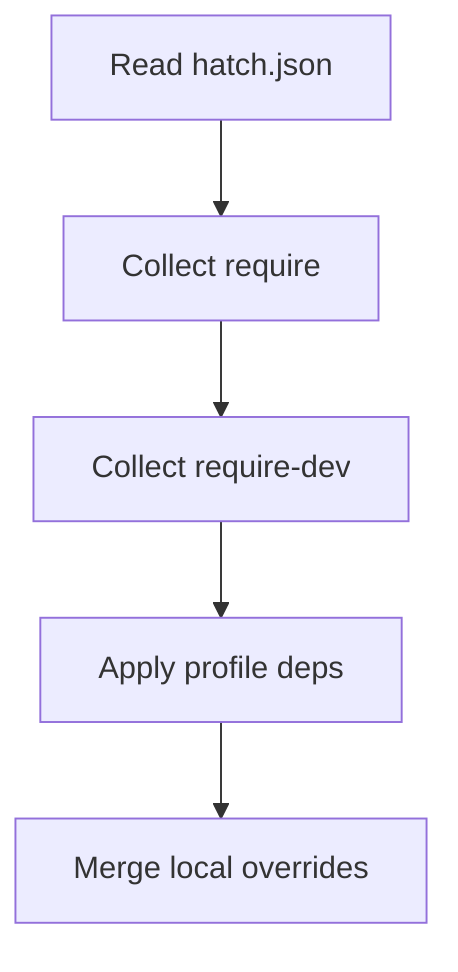

# Dependency Resolution

Hatch uses the Ultra Resolver - a dependency resolution algorithm optimized for speed and reliability.

## Table of Contents
- [Ultra Resolver](#ultra-resolver)
- [Resolution Process](#resolution-process)
- [Conflict Resolution](#conflict-resolution)
- [Performance Optimization](#performance-optimization)

## Resolution Overview

The Ultra Resolver is used for all dependency resolution. Note: Smart and Fast resolver implementations exist in the codebase but are not integrated.

## Ultra Resolver

The Ultra Resolver is Hatch's flagship resolution algorithm, offering the best balance of speed and reliability.

### Features
- **Parallel metadata fetching** with async/await
- **Batch-based resolution** tracking dependency levels (Batch 0: direct, Batch 1+: transitive)
- **Metadata caching** for improved performance
- **Progressive resolution** with conflict detection
- **Version selection** based on constraints

### How It Works

1. **Metadata Pre-fetching**
   ```
   📊 Fetching package metadata...
   Batch 0: Direct dependencies (parallel)
   Batch 1: First-level transitive (parallel)
   Batch 2: Second-level transitive (parallel)
   ```

2. **Resolution Process**
   - Fetches all root dependency metadata in parallel
   - Resolves dependencies level by level
   - Tracks which batch each package belongs to
   - Provides visual feedback on resolution progress

3. **Performance Characteristics**
   - ⚡ Fastest for standard dependency trees
   - 📦 Handles up to 1000+ dependencies efficiently
   - 💾 Minimal memory overhead with streaming
   - 🔄 Smart retry logic for network failures

### Code Example
```rust
// Ultra resolver with batch tracking
pub struct UltraResolver {
    metadata_cache: Arc<MetadataCache>,
    resolved_batch: HashMap<String, usize>,
    resolved_paths: HashMap<String, PathBuf>,
}
```

### Best For
- Most Flutter projects
- Projects with standard pub.dev dependencies
- CI/CD environments with good network connectivity
- Fresh installations without lockfiles


## Resolution Process

### 1. Dependency Collection


### 2. Version Resolution
```
Step 1: Check local packages (path dependencies)
Step 2: Check git dependencies
Step 3: Check private registries (nests)
Step 4: Check pub.dev
Step 5: Apply version overrides
```

### 3. Constraint Satisfaction
```rust
pub enum VersionConstraint {
    Any,                    // any or *
    Exact(String),         // 1.2.3
    Caret(String),         // ^1.2.3
    Tilde(String),         // ~1.2.3
    Range { min, max },    // >=1.0.0 <2.0.0
}
```

### 4. Package Installation
```
📥 Downloading packages...
   ├── http@1.1.0 (245 KB)
   ├── provider@6.0.5 (189 KB)
   └── collection@1.17.0 (67 KB)

📂 Extracting packages...
✅ Installation complete!
```

## Conflict Resolution

### Common Conflicts

#### Version Conflict
```
ERROR: Conflicting versions for 'http':
  - app requires ^1.0.0
  - dependency_a requires ^0.13.0

Resolution: Using version 0.13.6 (satisfies both)
```

#### Circular Dependency
```
WARNING: Circular dependency detected:
  package_a -> package_b -> package_c -> package_a

Resolution: Breaking cycle at package_c
```

#### Missing Dependency
```
ERROR: Package 'unknown_pkg' not found
Tried: pub.dev, configured nests

Resolution: Check package name and sources
```

### Resolution Strategies

1. **Version Intersection**
   - Find version that satisfies all constraints
   - Example: `^1.0.0` ∩ `>=1.2.0` = `>=1.2.0 <2.0.0`

2. **Constraint Relaxation**
   - Loosen strict constraints when safe
   - Example: `1.2.3` → `^1.2.3`

3. **Override Application**
   ```json
   "overrides": {
     "conflicting_package": "1.5.0"
   }
   ```

4. **Backtracking**
   - Try different version combinations
   - Undo choices that lead to conflicts

## Performance Optimization

### Caching Strategy

#### Metadata Cache
```
~/.hatch/cache/metadata/
├── pub.dev/
│   ├── http.json (cached 24h)
│   └── provider.json (cached 24h)
```

#### Package Cache
```
~/.hatch/cache/packages/
├── pub.dev/
│   ├── http/
│   │   └── 1.1.0/ (immutable)
```

### Network Optimization

1. **Connection Pooling**
   - Reuse HTTP connections
   - Default: 10 concurrent connections

2. **Parallel Downloads**
   ```rust
   const MAX_CONCURRENT_DOWNLOADS: usize = 5;
   ```

3. **Retry Logic**
   - Exponential backoff
   - Max 3 retries per package

### Memory Management

1. **Streaming Downloads**
   - Don't load entire package in memory
   - Stream directly to disk

2. **Lazy Metadata Loading**
   - Load package metadata on demand
   - Release after resolution

3. **Batch Processing**
   - Process dependencies in batches
   - Prevents memory spikes

## Verbosity Levels

Control resolution output with verbosity flags:

### Normal Mode
```bash
hatch install
```
```
📦 Installing dependencies...
✅ Resolved 25 packages
```

### Verbose Mode (-v)
```bash
hatch install -v
```
```
📦 Installing dependencies...
🔍 Resolving http ^1.0.0...
   Found version 1.1.0
✅ Resolved 25 packages
```

### Very Verbose Mode (-vv)
```bash
hatch install -vv
```
Shows resolution decisions and strategies.

### Debug Mode (-vvv)
```bash
hatch install -vvv
```
Full debug output with constraint matching details.

### Ultra Verbose Mode (-vvvv)
```bash
hatch install -vvvv
```
Complete trace including network requests and cache operations.

## Troubleshooting

### Common Issues

#### Slow Resolution
```bash
# Clear metadata cache
hatch cache clear --metadata

# Use fast resolver with lockfile
hatch install --fast
```

#### Resolution Failures
```bash
# Show why resolution failed
hatch why <package>

# Try smart resolver
HATCH_RESOLVER=smart hatch install

# Relax constraints
hatch install --relax-constraints
```

#### Network Issues
```bash
# Increase timeout
HATCH_TIMEOUT=60 hatch install

# Use proxy
HTTPS_PROXY=http://proxy:8080 hatch install
```

## Advanced Configuration

### Custom Resolution Rules

Create `.hatch/resolution.json`:
```json
{
  "strategy": "smart",
  "rules": {
    "prefer_stable": true,
    "allow_prerelease": false,
    "max_backtrack": 100
  },
  "aliases": {
    "package_name": {
      "1.0.0-broken": "1.0.1"
    }
  }
}
```

### Performance Tuning

Environment variables:
```bash
# Parallel fetch limit
HATCH_MAX_PARALLEL=20

# Cache TTL (seconds)
HATCH_CACHE_TTL=86400

# Connection timeout (seconds)
HATCH_TIMEOUT=30

# Resolver strategy
HATCH_RESOLVER=ultra
```

